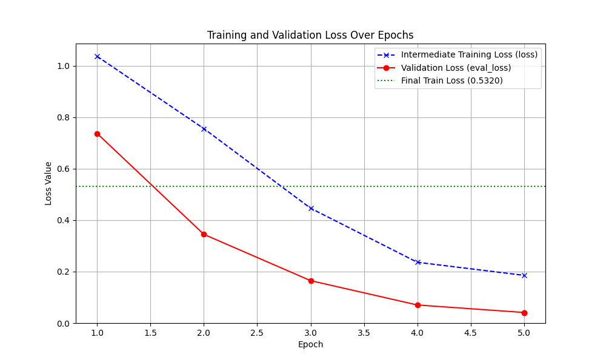
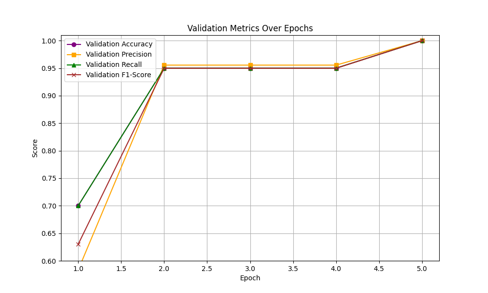

# dit-form-classifier
## 📋 개요 (Overview)
dit-form-classifier는 Microsoft의 Document Image Transformer (DiT) 모델을 검사 의뢰지 양식 분류 작업에 맞게 미세 조정한 프로젝트입니다.  
이 프로젝트는 이미지 기반의 문서 분류 모델을 개발, 훈련 및 평가하기 위한 코드베이스를 제공합니다.

- Python version = 3.10.16
- Python Modules: [requirements](https://github.com/Labgenomics-IT/dit-form-classifier/blob/main/requirements.txt)


## ✨ 주요 특징 (Key Features)
- 사전 훈련된 DiT-base 모델 미세 조정: 강력한 DiT-base의 특징 추출 능력을 활용하여 검사 의뢰지 양식 분류에 최적화된 모델을 구축합니다.
- 재현 가능한 훈련 파이프라인: Hugging Face Transformers Trainer API를 기반으로, 데이터 전처리부터 모델 훈련 및 평가까지 일관된 파이프라인을 제공합니다.
- PyTorch 기반: 널리 사용되는 딥러닝 프레임워크 PyTorch를 사용하여 개발되었습니다.


## 🛠️ 개발 환경 설정 (Development Environment Setup)
### 📦 필수 라이브러리 설치 (Prerequisites)
프로젝트 개발 및 실행에 필요한 모든 라이브러리는 requirements.txt 파일에 명시되어 있습니다.  
다음 명령어를 사용하여 가상 환경에 설치하는 것을 권장합니다.

```
# 1. 가상 환경 생성 (선택 사항, 권장)
conda create -n dit-env python=3.10 -y
conda activate dit-env

# 2. 필수 라이브러리 설치
pip install -r requirements.txt
```

### 📂 프로젝트 구조 (Project Structure)
주요 디렉토리 및 파일 설명:
```
dit-form-classifier/
├── src/
│   ├── models/                 # 모델 정의 및 관련 클래스
│   │   ├── trainer.py          # DiTModelTrainer 클래스 정의
│   │   └── predictor.py        # 학습된 DiT 모델을 사용하여 예측을 수행하는 클래스
│   ├── data/                   # 데이터셋 로딩 및 전처리 스크립트
│   │   ├── dataset.py          # 데이터셋 클래스 및 관련 함수
│   │   └── preprocessor.py     # 이미지 전처리를 위한 클래스 정의
│   ├── services/
│   │   └── predict_service.py  # 예측 비즈니스 로직 및 모델 인스턴스 관리
│   ├── web/
│   │   ├── static/             # 정적 파일 (CSS, JS, 이미지 등)
│   │   ├── templates/          # HTML 템플릿 파일
│   │   └── main.py             # FastAPI 애플리케이션 진입점 및 서버 시작 로직   
│   └── common/                 
│       └── common.py           # 유틸리티 함수 (예: get_timestamp, logger 설정 등)
├── scripts/
│   ├── train.py                # 모델 훈련 및 평가를 위한 메인 스크립트
│   └── predict.py              # 테스트 데이터셋 예측을 위한 스크립트 (CLI 용도)
├── saved_models/
│   └── dit-form-classifier/    # 파인튜닝된 모델 파일들이 저장될 실제 경로
│       ├── pytorch_model.bin   # 학습된 모델 가중치
│       ├── preprocessor_config.json    # 전처리기 설정
│       ├── config.json                 # 모델 구성 설정
│       └── label_mapping.json          # 클래스 ID와 레이블 매핑
├── config.py                   # 전역 설정 및 하이퍼파라미터 정의
├── requirements.txt            # 프로젝트 의존성 목록
└── README.md                   # README


```

## 🚀 FastAPI API 사용법 (FastAPI API Prediction)
프로젝트에 포함된 FastAPI 애플리케이션을 실행하여 웹 API를 통해 예측 서비스를 제공할 수 있습니다.  
이 API는 가장 성능이 좋았던 모델(기본값: saved_models/dit-form-classifier/에 저장된 모델)을 자동으로 로드하여 사용합니다.

### 🍄 필수 모델 파일 다운로드 (Required Model Files Download)
1. **모델 다운로드 링크:** [fine_tuned_dit_classifier](https://labgenomics365.sharepoint.com/:u:/s/IT/ESNX2rjJfE5BuPHbEu24tOIBHI1GS9i1G23ERXVFChBmmQ?e=NteN02)  
2.  다운로드 받은 `fine_tuned_dit_classifier` 압축 파일을 해제한 후, 프로젝트 구조와 같이 다음 경로에 배치해주세요:
    ```
    dit-form-classifier/
    └── saved_models/
        └── fine_tuned_dit_classifier/
            ├── pytorch_model.bin
            ├── preprocessor_config.json
            ├── config.json
            └── label_mapping.json
    ```
    이후 모든 예측 기능을 정상적으로 사용할 수 있습니다.

### 💾 FastAPI 서버 실행
```
uvicorn src.web.main:app --host 0.0.0.0 --port 8000 --reload
```

### ✨ FastAPI 서버 실행
서버가 실행되면 웹 브라우저에서 http://localhost/:8000/docs 에 접속하여 Swagger UI를 통해 API 문서를 확인하고 테스트할 수 있습니다.

API 엔드포인트:

- 단일 이미지 예측: /predict/single_image: POST 요청으로 이미지 파일 하나를 업로드합니다.
- 다중 이미지 예측: /predict/multiple_images: POST 요청으로 여러 이미지 파일을 동시에 업로드합니다.


## 🦮 모델 훈련 및 예측 스크립트 사용법 (Usage)
### 💾 데이터셋 준비 (Dataset Preparation)
모델 훈련을 위해서는 특정 디렉토리 구조로 데이터셋이 구성된 다음 config.py에서 경로지정을 해주어야 합니다.  
훈련할 클래스 만큼 디렉토리를 만들고 클래스 이름과 디렉토리명을 일치시킵니다.  
각 클래스별 이미지는 해당 클래스 이름의 하위 디렉토리 내에 위치해야 합니다.
```
ex)

data/
├── train/
│   ├── g-scanning/
│   │   ├── image_001.png
│   │   └── image_002.png
│   ├── the-mom-scanning/
│   │   ├── image_003.png
│   │   └── image_004.png
│   └── others/
        ├── image_005.png
        └── image_006.png

```

### 🏃‍♂️ 모델 훈련 및 평가 (Training & Evaluation)
모델 훈련을 위한 모든 하이퍼파라미터 및 경로는 config.py 파일에 정의되어 있습니다.  
이 파일을 수정하여 훈련 설정을 조정한 후, 루트 디렉토리에서 다음 명령어를 실행하여 훈련을 시작합니다.
```
python -m scripts.train
```

**훈련 설정 변경 방법:**
훈련 에폭 수, 배치 크기, 모델 저장 전략 등 모든 훈련 관련 설정은 config.py 파일에서 직접 수정할 수 있습니다.  
예를 들어, 훈련 에폭 수를 20으로 변경하려면 config.py 파일을 열어 NUM_TRAIN_EPOCHS 변수의 값을 수정하면 됩니다.

```
# config.py 예시
# ...
NUM_TRAIN_EPOCHS = 20 # 이 값을 변경하여 훈련 에폭 수 조정
PER_DEVICE_TRAIN_BATCH_SIZE = 8
SAVE_STRATEGY = "epoch"
# ...
```

### 💡 학습된 모델을 사용하여 예측 (Model Prediction)
1. predict.py 의 main 인입점에 직접 테스트 데이터가 있는 디렉토리를 지정해서 사용해주세요.
   ```
   test_single_image_path = "F:\\Datasets\\test_dataset\\신규더맘의뢰서.jpg" # 실제 테스트 이미지 경로로 변경 필요
   test_directory_path =  "F:\\Datasets\\request_form\\model_test_data"
   ```
2. 아래 스크립트를 실행하면 훈련 후 가장 성능이 좋았던 모델(위치: runs/fine_tuned_dit_classifier/)을 로드하여 사용합니다.
    ```
    python -m scripts.predict
    ```


## 📊 훈련 결과 (Training Results)
최근 훈련 (num_train_epochs=5으로 eval_accuracy 기준 최적 모델 저장) 결과 요약:

| epoch | `loss` | `eval_loss` | `eval_accuracy` | `eval_precision` | `eval_recall` | `eval_f1` |
| :--- | :--------------- | :-------------------- | :-------------------- | :--------------------- | :---------------- | :------------------ |
| 1.0  | 1.0364           | 0.7368                | 0.700                 | 0.5833                 | 0.700             | 0.6300              |
| 2.0  | 0.7557           | 0.3447                | 0.950                 | 0.9556                 | 0.950             | 0.9498              |
| 3.0  | 0.4463           | 0.1649                | 0.950                 | 0.9556                 | 0.950             | 0.9498              |
| 4.0  | 0.2363           | 0.0703                | 0.950                 | 0.9556                 | 0.950             | 0.9498              |
| 5.0  | 0.1855           | 0.0411                | 1.000                 | 1.0000                 | 1.000             | 1.0000              |
| **최종** | **0.5320** | **0.0411** | **1.000** | **1.0000** | **1.000** | **1.0000** |

**참고:** `최종 eval_loss`는 `load_best_model_at_end` 설정에 따라 최적의 `eval_accuracy` (1.0)를 달성한 에폭 5.0의 손실 값입니다.  
최종 `train_loss`는 훈련 종료 시점의 총 훈련 손실 평균입니다.

### 📈 훈련 과정 시각화 (Training Progress Visualizations)
훈련 스크립트 실행 후 output_dir 내에 자동으로 생성되는 학습 손실 및 검증 지표 그래프입니다.

- Training and Validation Loss Over Epochs  

 

- Validation Metrics Over Epochs (Accuracy, Precision, Recall, F1-Score)




